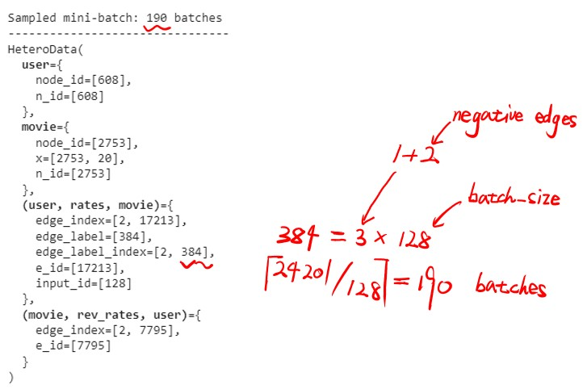

[TOC]

---

# HOW CAN WE UPDATE THE `node_feat` WITH THE INCREASE OF `timestep`?

## Choice 1: imitating the *DGRS* paper

**Inappropriate！**

## Choice 2: using `torch.nn.TransformerDecoder`?

**Yes!**

1. Using a Heterogeneous GNN to get `node_feat` of each subgraph (spilted by timestep, packed as mini-batch)
2. Using `torch.nn.TransformerDecoder` with `mask` to apply self-attention mechanism on each node's `node_feat` over timesteps!
3. make final links prediction!

---

# HOW CAN WE MAKE FINAL LINKS PREDICTION?

## Choice 1: Apply dot-product between `node_feat`s which are sliced by `edge_index`

```python
# Our final classifier applies the dot-product between source and destination
# node embeddings to derive edge-level predictions:
class Classifier(torch.nn.Module):
    def forward(self, x_user: Tensor, x_movie: Tensor, edge_label_index: Tensor) -> Tensor:
        # Convert node embeddings to edge-level representations:
        edge_feat_user = x_user[edge_label_index[0]]
        edge_feat_movie = x_movie[edge_label_index[1]]

        # Apply dot-product to get a prediction per supervision edge:
        return (edge_feat_user * edge_feat_movie).sum(dim=-1)
```

v.i.a: [Link Prediction on MovieLens](https://colab.research.google.com/drive/1xpzn1Nvai1ygd_P5Yambc_oe4VBPK_ZT?usp=sharing)

## Choice 2: Using projection matrix

### Single score

For example, in *DGRS* paper the author calculated $s_{ui} \in R$ represents for the edge score between specific user and item node:

$$
\begin{aligned}
    s_{ui} &= h_u^TW_pe_i \\\\
    \text{where} \quad h_u \in R^{d(1+L) \times 1} &= h_u^{(0)} || h_u^{(1)} || \dots || h_u^{(L)} \\
    W_p \in R^{d(1+L) \times d} &= \text{projection matrix} \\
    e_i \in R^{d \times 1} &= \text{item embedding}
\end{aligned}
$$

### Parallelization

Not surprisingly, we can find the calculate of score can be parallel by using matrix:

- Let $H_u \in R^{d(1+L) \times n} = [h_{u_0}, h_{u_1}, \dots, h_{u_{n-1}}]$ be the matrix that collects all $h_{u_i}$
  - $n$: the total number of user nodes
  - $h_{u_i}$: the final embedding of $i$-th user
- Let $E_i \in R^{d \times m} = [e_{i_0}, e_{i_1}, \dots, e_{i_{m-1}}]$ be the matrix that collects all $e_{i_j}$
  - $m$: the total number of item nodes
  - $e_{i_j}$: the embedding of $i$-th item

Finally, we get the score matrix $s \in R^{n \times m}$ by:

$$
s = H_u^TW_pE_i = 
\begin{bmatrix}
    s_{11} & s_{12} & \dots & s_{1m} \\
    s_{21} & s_{22} & \dots & s_{2m} \\
    \vdots & \vdots &       & \vdots \\
    s_{n1} & s_{n2} & \dots & s_{nm} \\
\end{bmatrix}_{n \times m}
$$

Note: `sigmoid()` is need at last. However, I found that if we use the `BCEWithLogitsLoss`, it will do `sigmoid()`.

> This loss combines a Sigmoid layer and the BCELoss in one single class. 
> This version is more numerically stable than using a plain Sigmoid followed by a BCELoss as, by combining the operations into one layer, we take advantage of the log-sum-exp trick for numerical stability.
> v.i.a. [torch.nn.BCEWithLogitsLoss](https://pytorch.org/docs/1.13/generated/torch.nn.BCEWithLogitsLoss.html#torch.nn.BCEWithLogitsLoss)

---

# WHY JUST L-layers `DGRSlayer`?

In code <https://github.com/ZM7/DGSR/tree/master>:

```python
for conv in self.layers:
    feat_dict = conv(g, feat_dict)
    user_layer.append(graph_user(g, user_index, feat_dict['user']))
```

`DGRS` model just took L-layers `DGRSlayer` to update $h_u$ and $h_i$, did not make use of TIME-SERIES INFOMATION to update $h_u$ and $h_i$?

The reason is that the edges in $\mathcal{G}^m_u(t_k)$ are non-repeated. In other word, during one user's time sequence $T^u = (t_1, t_2, \dots, t_k)$, items sequence $S^u = (i_1, i_2, \dots, i_k)$ is UNIQUE!

## Dynamic to static

Therefore, by runing the *Sub-graph Sampling Algorithm* in $\xi 4.2$ of source paper, the author turns a huge **dynamic** graph to lots of small **static** sub-graphs!

## `DGRS` model is incompatible in our case

The reason why it's incompatible is that the edges in different timesteps may repeat! For instance: 

- admission $A_1$ may do labtiems $(L_1, L_2)$ at timestep $t_0$, 
- admission $A_1$ may do labtiems $(L_1, L_2, L_3, L_4)$ at timestep $t_1$!

So, during admission $A_1$'s time sequence $T^u = (t_1, t_2, \dots)$, labitems sequence $S^l = (l_1, l_2, \dots)$ is NOT UNIQUE!

# NODES NUMBER DON'T NEED TO BE FIX!

Does the number of nodes in a `HeteroData` which will be input into Heterogeneous GNN need to be fix?

**No!**

`GraphConv`:

$$
\begin{aligned}
    x^{'}_i &= W_1x_i + W_2 \sum\limits_{j \in \mathcal{N}(i)} e_{j, i} \cdot x_j \\
    x_i, x_j &\in R^{d_{in} \times 1} \\
    W_1, W_2 &\in R^{d_{out} \times d_{in}} \\
    e_{i, j} & \quad \text{is the edge weight} \\
    x^{'}_i &\in R^{d_{out} \times 1}
\end{aligned}
$$

`GINConv`

$$
\begin{aligned}
    x^{'}_i &= h_{\Theta} \bigg( (1 + \epsilon) \cdot x_i + \sum\limits_{j \in \mathcal{N}(i)} x_j \bigg), \quad \text{when} \quad x^{'}_i \in R^{d_{in} \times 1} \\
    X^{'} &= h_{\Theta} ((A + (1 + \epsilon) \cdot I) \cdot X), \quad \text{when} \quad X^{'} \in R^{d_{in} \times n} \\
    \text{Note:} \quad h_{\Theta} &: \text{denotes a neural network, .i.e. an MLP, which has a $W \in R^{d_{in} \times d_{out}}$} 
\end{aligned}
$$

In both cases, the demension of $W$s **remains the same**!

---

# Negative edges are not needed

## Why negative edges are needed in *Link Prediction on MovieLens*?

The `HeteroData` graphs generated in *Link Prediction on MovieLens* are static! So they need negative edges for **self-supervise**.

## How will Negative edges be used in *Link Prediction on MovieLens*?

As we already know, *Link Prediction on MovieLens* project applies dot-product between `node_feat`s which are sliced by `edge_index`.

After then, it does a 2-classification task over both positive and negative edges by using `F.binary_cross_entropy_with_logits`.

## Why our *LERS* does not need negative edges?

- First and most important, our `HeteroData` graph is **dynamic**!
- every subgraph splited by timestep has natual labels which comes from next timestep.

## How should we do?

1. Do train-val-test split on original `DataFrame` by `HADMID`
2. Furtherly, dividing each split into many mini-batch by `HADMID` (optional when memory is not enough)
3. Divided into the following two situations：

   - No batch: just build a whole `HeteroData`
   - With batches: build `HeteroData` on each batch

4. Spliting each `HeteroData` by `timestep` and adding labels

After that, it is the work of GNN.

---

# Why we can not simplely use `LinkNeighborLoader` for mini-batches like *Link Prediction on MovieLens* project did?

Because `LinkNeighborLoader` is **not suitable** to our data.

## How *Link Prediction on MovieLens* used `LinkNeighborLoader`?

### Step 1. Edges-level train-val-test split over entire graph

As the codes showing below, *Link Prediction on MovieLens* project leveraged `LinkNeighborLoader` to:

- split the set of edges into
  - training (80%)
  - validation (10%)
  - testing edges (10%)
- across the training edges, they used:
  - 70% of edges for message passing
  - 30% of edges for supervision
- generated fixed negative edges for evaluation with a ratio of 2:1
- generated negative edges for training on-the-fly (so the `edge_label` in `train_data` are all $1$!)

```python
transform = T.RandomLinkSplit(
    num_val=0.1,
    num_test=0.1,
    disjoint_train_ratio=0.3,
    neg_sampling_ratio=2/1,
    add_negative_train_samples=False,  # generated negative edges for training on-the-fly
    edge_types=("user", "rates", "movie"),
    rev_edge_types=("movie", "rev_rates", "user"), 
)
```

<center>
    <br>
</center>

### Step 2. divide mini-batches on each split

*Link Prediction on MovieLens* project then created a mini-batch loader that will generate subgraphs that can be used as input into our GNN.

While this step is not strictly necessary for small-scale graphs, it is absolutely necessary to apply GNNs on **larger graphs** that do not fit onto GPU memory otherwise.

```python
# Define seed edges:
edge_label_index = train_data["user", "rates", "movie"].edge_label_index
edge_label = train_data["user", "rates", "movie"].edge_label

train_loader = LinkNeighborLoader(
    data=train_data,
    # first hop, sample at most 20 neighbors; 
    # second hop, sample at most 10 neighbors;
    num_neighbors=[20, 10],  
    neg_sampling_ratio=2/1,  # generate negative edges on-the-fly with a ratio of 2:1
    edge_label_index=(("user", "rates", "movie"), edge_label_index),
    edge_label=edge_label,
    batch_size=128,
    shuffle=True,
)
```

==Notice== that `LinkNeighborLoader` only sample mini-batches from `train_data["user", "rates", "movie"].edge_label_index` which are supervise edges in train split. This is because the arg `edge_label_index` in `LinkNeighborLoader` [(v.i.a)](https://pytorch-geometric.readthedocs.io/en/stable/modules/loader.html#torch_geometric.loader.NeighborLoader):

> - edge_label_index (Tensor or EdgeType or Tuple[EdgeType, Tensor]) – The edge indices for which neighbors are sampled to create mini-batches

<center>
    <br>
</center>

### Step 3. different `edge_index`s were used in different places

As the codes showing below, we can see:

- all egdes which are used for message passing were being used in GNN
- while link-predict modual `self.classifier` only use **batch** of supervise edges which have been sample in `LinkNeighborLoader`

```python
# `x_dict` holds feature matrices of all node types
# `edge_index_dict` holds all edge indices of all edge types
    # The edge_label_index indicates which edges are your supervision edges, 
    # so the ones that you are going to get model predictions for, 
    # so the samples that you will optimise your model on.
    # v.i.a: <https://github.com/pyg-team/pytorch_geometric/issues/3958>
x_dict = self.gnn(x_dict, data.edge_index_dict)
pred = self.classifier(
    x_dict["user"],
    x_dict["movie"],
    data["user", "rates", "movie"].edge_label_index,
)
```

## What should we use for constructing mini-batches?

Just split by `HADM_ID`.

---

# Why `nn.Embedding` is needed in our case?

In *Link Prediction on MovieLens* project, we saw the author using `nn.Embedding` as:

```python
# Since the dataset does not come with rich features,we also learn two
# embedding matrices for users and movies:
self.user_emb = torch.nn.Embedding(data["user"]num_nodes, hidden_channels)
self.movie_emb = torch.nn.Embedding(data["movie"]num_nodes, hidden_channels)
```

Just because I mistook the shape arg:

- Wrong: `shape=(scores.shape[0], scores.shape[1]))`
- Right: `shape=(scores.shape[-2], scores.shape[-1]))`

As the scores tensor has shape of `[20, 128, 753]`
